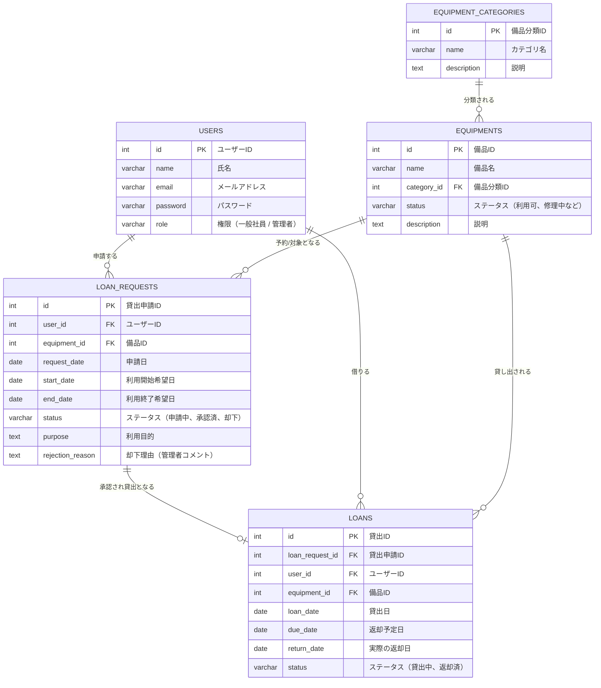

# ER図

## エンティティ（テーブル）の説明

| エンティティ名 | 論理名 | 説明 |
| :--- | :--- | :--- |
| **USERS** | 利用者 | システムを利用する一般社員および管理者のアカウント情報を管理します。 |
| **EQUIPMENT_CATEGORIES** | 備品分類 | 備品のカテゴリ（PC本体、モニター、ケーブル等）を管理します。 |
| **EQUIPMENTS** | 備品 | 貸出対象の備品「1つ1つの個体（実体）」としての情報を管理します。個体ごとのステータス（故障など）を管理可能です。 |
| **LOAN_REQUESTS** | 貸出申請 | 誰が、どの個体を、いつからいつまで借りたいかという「申請」を管理します。 |
| **LOANS** | 貸出 | 承認された申請をもとに、実際の貸出から返却完了までの状態を管理します。遅延などの判定に利用します。 |

## リレーションシップの説明
- **利用者 (USERS) と 貸出申請 (LOAN_REQUESTS) / 貸出 (LOANS)**
  - 1人の利用者は、0回以上の貸出申請および貸出の履歴を持ちます。
- **備品分類 (EQUIPMENT_CATEGORIES) と 備品 (EQUIPMENTS)**
  - 1つの備品分類には、複数の備品が属します。
- **備品 (EQUIPMENTS) と 貸出申請 (LOAN_REQUESTS) / 貸出 (LOANS)**
  - 1つの備品は、0回以上の貸出申請や貸出履歴を持ちます。
- **貸出申請 (LOAN_REQUESTS) と 貸出 (LOANS)**
  - 1つの貸出申請が承認されると、最大で1つの貸出レコードが生成されます（`1 : 0..1`）。
