# ER図

```mermaid
erDiagram
    USERS ||--o{ LOAN_REQUESTS : "申請する"
    EQUIPMENTS ||--o{ LOAN_REQUESTS : "対象となる"
    EQUIPMENT_CATEGORIES ||--o{ EQUIPMENTS : "分類される"

    %% 利用者テーブル
    USERS {
        int id PK "ユーザーID"
        varchar name "氏名"
        varchar email "メールアドレス"
        varchar password "パスワード"
        varchar role "権限（一般社員 / 管理者）"
    }

    %% 備品分類（カテゴリ）テーブル
    EQUIPMENT_CATEGORIES {
        int id PK "備品分類ID"
        varchar name "カテゴリ名"
        text description "説明"
    }

    %% 備品テーブル
    EQUIPMENTS {
        int id PK "備品ID"
        varchar name "備品名"
        int category_id FK "備品分類ID"
        varchar status "ステータス（利用可、修理中など）"
        text description "説明"
    }

    %% 貸出情報（申請・状態管理）テーブル
    LOAN_REQUESTS {
        int id PK "貸出ID"
        int user_id FK "ユーザーID"
        int equipment_id FK "備品ID"
        date request_date "申請日"
        date start_date "利用開始日"
        date end_date "利用終了（返却）予定日"
        varchar status "ステータス（申請中、承認済、却下、返却済）"
        text purpose "利用目的"
        text rejection_reason "却下理由（管理者コメント）"
        date return_date "実際の返却日"
    }
```

## エンティティ（テーブル）の説明

| エンティティ名 | 論理名 | 説明 |
| :--- | :--- | :--- |
| **USERS** | 利用者 | システムを利用する一般社員および管理者のアカウント情報を管理します。 |
| **EQUIPMENT_CATEGORIES** | 備品分類 | 備品のカテゴリ（PC本体、モニター、ケーブル等）を管理します。 |
| **EQUIPMENTS** | 備品 | 貸出対象の備品「1つ1つの個体（実体）」としての情報を管理します。個体ごとのステータス（故障など）を管理可能です。 |
| **LOAN_REQUESTS** | 貸出状態（申請情報） | 誰が、どの個体（備品）を、いつからいつまで借りるかという「申請」と、その後の状態を管理します。 |

## リレーションシップの説明
- **利用者 (USERS) と 貸出情報 (LOAN_REQUESTS)**
  - 1人の利用者は、0回以上の貸出申請（貸出履歴）を持ちます。（`1 : 0..N` または `1 : 多`）
- **備品分類 (EQUIPMENT_CATEGORIES) と 備品 (EQUIPMENTS)**
  - 1つの備品分類には、複数の備品が属します。（`1 : 0..N` または `1 : 多`）
- **備品 (EQUIPMENTS) と 貸出情報 (LOAN_REQUESTS)**
  - 1つの備品は、過去から現在を通して0回以上の貸出履歴（貸出申請）を持ちます。（`1 : 0..N` または `1 : 多`）
