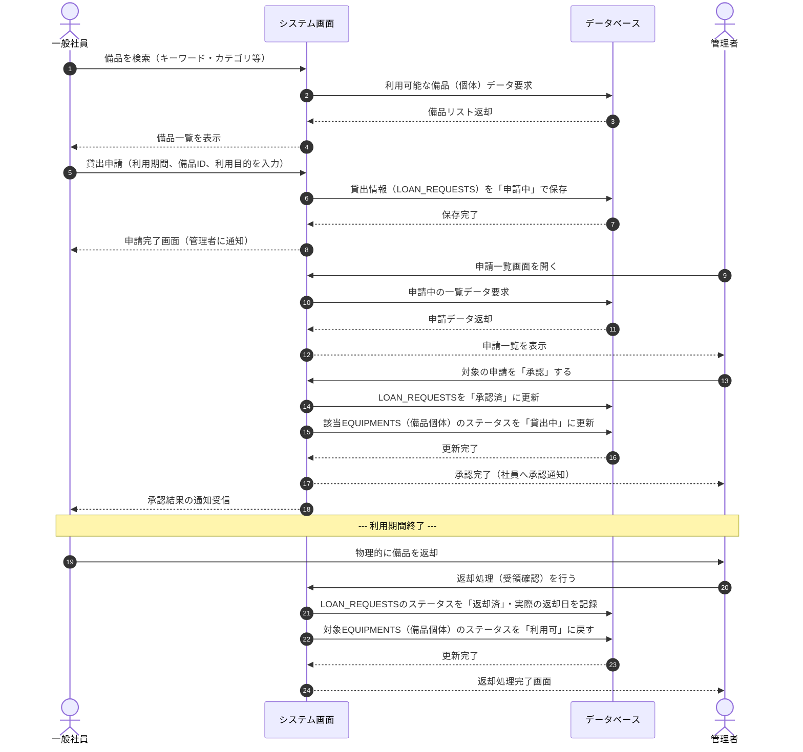

# シーケンス図および状態遷移図

## 1. シーケンス図（貸出申請〜承認〜返却）

---

### ステータスの説明

| ステータス | 意味                                                                 | 備考                                                               |
| :--------- | :------------------------------------------------------------------- | :----------------------------------------------------------------- |
| **利用可** | 在庫として存在しており、誰でも貸出申請が可能な状態。                 | このステータスの備品のみ検索結果として表示されるのが望ましいです。 |
| **貸出中** | 現在誰かに貸し出されており、利用中の状態。                           | 複数人が同時に同じ個体を借りないよう、システムでブロックします。   |
| **修理中** | 故障等の不具合があり、貸出しできない状態。                           | 修理が完了すれば「利用可」に戻ります。                             |
| **廃棄済** | 修理不能・紛失などでシステム上の管理対象（資産）から外した最終状態。 | 物理的にも破棄・除却されていることを想定します。                   |
