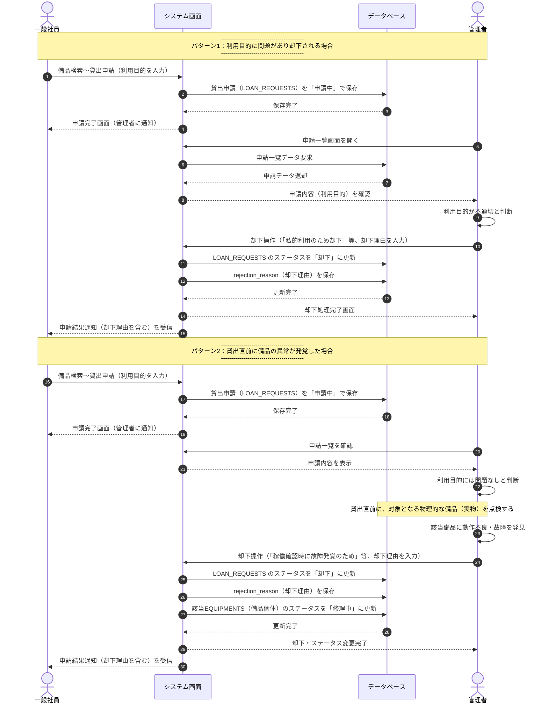

# シーケンス図（異常系：申請の却下フロー）

一般社員からの備品貸出申請に対し、管理者が「申請を却下する」場合のフローを示します。
却下事由として以下の2つのパターンを想定しており、いずれの場合も利用者に却下理由（コメント）が通知されます。

1. **利用目的に問題がある場合**
2. **利用目的は正常だが、実物点検で備品の異常（故障など）が見つかった場合**

```mermaid
sequenceDiagram
    autonumber
    actor User as 一般社員
    participant Web as システム画面
    participant DB as データベース
    actor Admin as 管理者

    Note over User,Admin: -----------------------------------------<br/>パターン1：利用目的に問題があり却下される場合<br/>-----------------------------------------
    User->>Web: 備品検索〜貸出申請（利用目的を入力）
    Web->>DB: 貸出申請（LOAN_REQUESTS）を「申請中」で保存
    DB-->>Web: 保存完了
    Web-->>User: 申請完了画面（管理者に通知）

    Admin->>Web: 申請一覧画面を開く
    Web->>DB: 申請一覧データ要求
    DB-->>Web: 申請データ返却
    Web-->>Admin: 申請内容（利用目的）を確認
    
    Admin->>Admin: 利用目的が不適切と判断
    
    Admin->>Web: 却下操作（「私的利用のため却下」等、却下理由を入力）
    Web->>DB: LOAN_REQUESTS のステータスを「却下」に更新
    Web->>DB: rejection_reason（却下理由）を保存
    DB-->>Web: 更新完了
    Web-->>Admin: 却下処理完了画面
    Web-->>User: 申請結果通知（却下理由を含む）を受信


    Note over User,Admin: -----------------------------------------<br/>パターン2：貸出直前に備品の異常が発覚した場合<br/>-----------------------------------------
    User->>Web: 備品検索〜貸出申請（利用目的を入力）
    Web->>DB: 貸出申請（LOAN_REQUESTS）を「申請中」で保存
    DB-->>Web: 保存完了
    Web-->>User: 申請完了画面（管理者に通知）

    Admin->>Web: 申請一覧を確認
    Web-->>Admin: 申請内容を表示
    Admin->>Admin: 利用目的には問題なしと判断
    
    Note over Admin,DB: 貸出直前に、対象となる物理的な備品（実物）を点検する
    Admin->>Admin: 該当備品に動作不良・故障を発見

    Admin->>Web: 却下操作（「稼働確認時に故障発覚のため」等、却下理由を入力）
    Web->>DB: LOAN_REQUESTS のステータスを「却下」に更新
    Web->>DB: rejection_reason（却下理由）を保存
    Web->>DB: 該当EQUIPMENTS（備品個体）のステータスを「修理中」に更新
    DB-->>Web: 更新完了
    Web-->>Admin: 却下・ステータス変更完了
    Web-->>User: 申請結果通知（却下理由を含む）を受信
```
