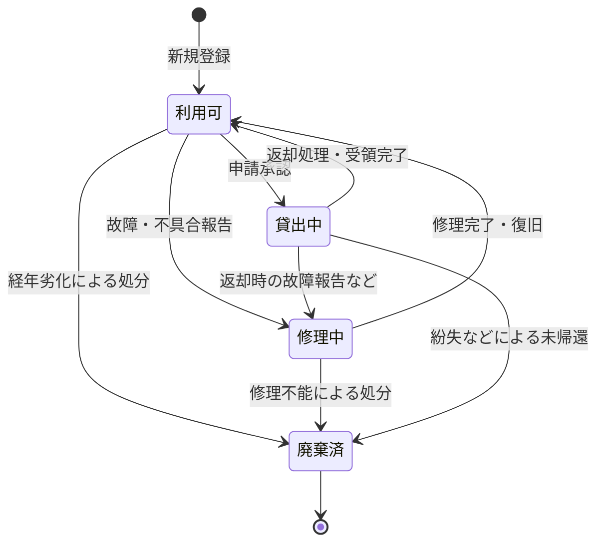

# 状態遷移図

## 1. 備品テーブルのステータス状態遷移図

システムで管理される備品（個体）についての状態がどのように変わるかを示した図です。

```mermaid
stateDiagram-v2
    [*] --> 利用可 : 新規登録

    利用可 --> 貸出中 : 申請承認
    貸出中 --> 利用可 : 返却処理・受領完了

    利用可 --> 修理中 : 故障・不具合報告
    貸出中 --> 修理中 : 返却時の故障報告など
    修理中 --> 利用可 : 修理完了・復旧

    利用可 --> 廃棄済 : 経年劣化による処分
    修理中 --> 廃棄済 : 修理不能による処分
    貸出中 --> 廃棄済 : 紛失などによる未帰還

    廃棄済 --> [*]
```
