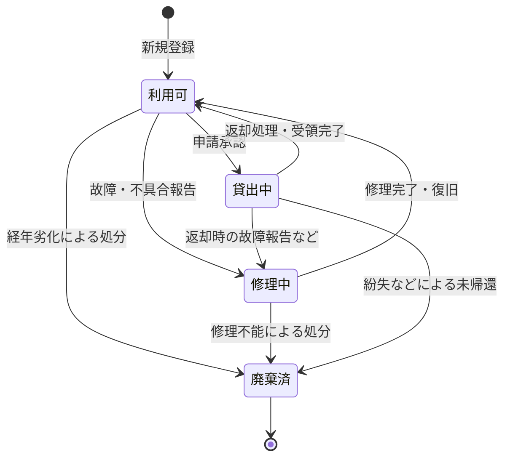
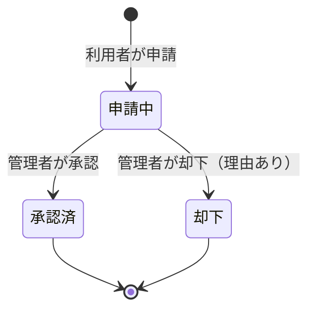
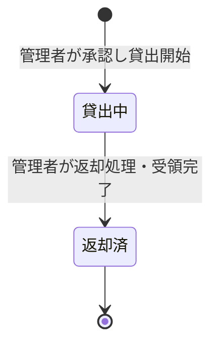

# 状態遷移図

## 1. 備品（EQUIPMENTS）のステータス状態遷移図

システムで管理される備品（個体）についての状態がどのように変わるかを示した図です。

## 2. 貸出申請（LOAN_REQUESTS）のステータス状態遷移図

利用者が申請してから、管理者が承認または却下するまでの状態遷移です。

## 3. 貸出（LOANS）のステータス状態遷移図

申請が「承認済」となった後に生成され、備品が貸し出されてから返却されるまでの状態遷移です。
※遅延の判定は、「貸出中」かつ現在日付が「返却予定日」を過ぎているかという計算で求められます。

