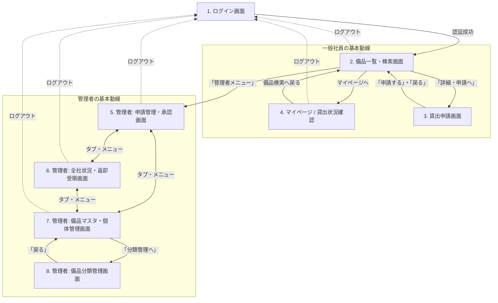

# 画面遷移図

## 各画面の役割

1. **ログイン画面**: 全ての利用者の入り口。未認証ユーザーはここにリダイレクトされます。
2. **備品一覧・検索画面**: 貸出可能な備品を探すためのシステム上の「ホーム画面」。
3. **貸出申請画面**: 備品ごとに利用目的と期間を入力して管理者に申請を送るためのフォーム。
4. **マイページ**: 自分の貸出状態（申請中、貸出中、却下などのステータスや履歴）を確認するための画面。
5. **管理者: 申請管理画面**: 届いた新しい「申請」をさばく（承認または却下理由を入力して却下する）画面。
6. **管理者: 全社状況・返却画面**: 「貸出中」になっている全備品の一覧と遅延の確認、そして実際の備品が戻ってきた際の「返却処理」を行う画面。
7. **管理者: 備品マスタ管理画面**: 備品の個体を新たに登録したり、物理的な故障による「修理中/廃棄済」へのステータス強制変更を行う画面。
8. **管理者: 備品分類（カテゴリ）管理画面**: 新規カテゴリ（PC、プロジェクタ等）の追加・編集画面。
